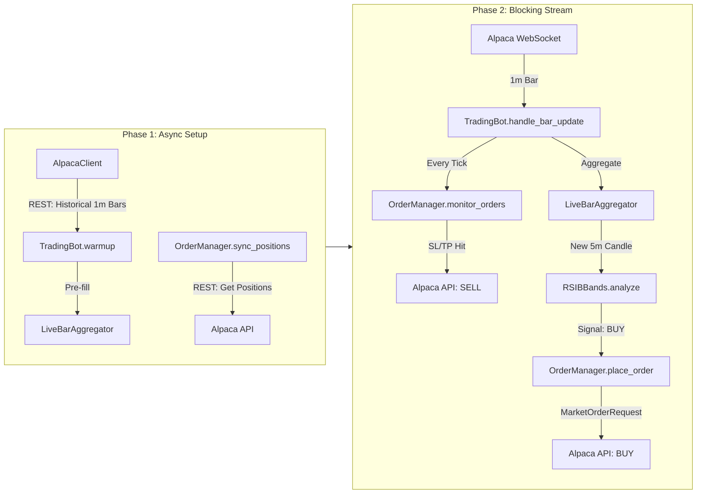

# Architecture Guide

This document explains how Build-A-Bot works internally: the execution model, the data pipeline, the strategy engine, the safety systems, and order execution.

---

## System Diagram



### Data flow summary

1. **Startup:** Historical bars fill the aggregators. Existing positions are adopted.
2. **Runtime:** Each incoming 1-minute bar triggers two paths in parallel:
   - **Exit path:** Check all active orders against current price (stop-loss / take-profit).
   - **Entry path:** Aggregate the bar. If a new 5-minute candle completes, run the strategy. If the strategy returns a BUY signal, place an order.

---

## The Hybrid Engine

### Why two phases?

Alpaca's `StockDataStream.run()` starts its own internal asyncio event loop to manage the WebSocket connection. This means it cannot be called from within an existing `asyncio.run()` -- the two loops would conflict. The solution is a two-phase execution model.

### Phase 1: Async Setup (`asyncio.run`)

`main.py` defines an inner `async def setup_phase()` and runs it with `asyncio.run()`:

```python
async def setup_phase():
    await bot.warmup(data_client)   # Fetch historical bars (I/O bound)
    await bot.run()                 # Sync positions + subscribe to stream
```

This phase handles all operations that benefit from async I/O:
- **Warmup:** Multiple HTTP requests to Alpaca's REST API to fetch historical data.
- **State Sync:** A REST call to `get_all_positions()`.
- **Subscription:** Registers the `handle_bar_update` callback on the data stream (does not start the stream).

When `asyncio.run()` completes, the event loop is torn down cleanly.

### Phase 2: Blocking Stream (`data_stream.run()`)

After async setup finishes, `main.py` calls:

```python
data_stream.run()
```

This is a **blocking** call. Alpaca's SDK creates its own event loop, opens a WebSocket to the market data feed, and dispatches incoming bars to the registered callback (`handle_bar_update`). The main thread is occupied until the process is interrupted with `Ctrl+C` or an exception occurs.

### Why this matters

The callback `handle_bar_update` is defined as `async def` -- Alpaca's internal loop schedules it as a coroutine. From the bot's perspective, the callback runs in a single-threaded async context managed entirely by the SDK. No manual thread management or locking is needed.

---

## Data Pipeline

### Source: Alpaca WebSocket

The `StockDataStream` delivers 1-minute OHLCV bars for each subscribed symbol. Each bar arrives as an `alpaca.data.models.bars.Bar` object with attributes: `symbol`, `timestamp`, `open`, `high`, `low`, `close`, `volume`.

### Stage 1: Bar Aggregation (`LiveBarAggregator`)

**File:** `src/utils/bar_aggregator.py`

Each symbol gets its own `LiveBarAggregator` instance, stored in `TradingBot.lba_dict`. The aggregator converts a stream of 1-minute bars into N-minute candles (default: 5-minute).

**How it works:**

1. Incoming 1-minute bars are appended to an internal `buffer` (a list of dicts).
2. When the buffer reaches the target size (e.g., 5 bars), it aggregates:
   - `open` = first bar's open
   - `high` = max of all highs
   - `low` = min of all lows
   - `close` = last bar's close
   - `volume` = sum of all volumes
   - `timestamp` = last bar's timestamp
3. The aggregated candle is appended to `history_df`, a Polars DataFrame.
4. `history_df` is trimmed to the last `history_size` rows (default: 240).
5. The buffer is cleared, and `add_bar()` returns `True` to signal a new candle.

**Why Polars?**

The aggregated `history_df` is passed directly to the strategy's `analyze()` method. Polars DataFrames are columnar and cache-friendly, making indicator calculations (extracting numpy arrays from columns) fast. The rolling window trim (`tail(history_size)`) is O(1) in Polars since it creates a view, not a copy.

### Stage 2: Technical Indicators (TA-Lib)

The strategy receives the Polars DataFrame and extracts the `close` column as a numpy array. TA-Lib functions operate on numpy arrays directly:

```
close_array = df["close"].to_numpy()
upper, middle, lower = talib.BBANDS(close_array, ...)
rsi = talib.RSI(close_array, ...)
bandwidth_roc = talib.ROC(upper - lower, ...)
```

No intermediate conversion to Pandas is needed. The data stays in efficient native formats throughout.

---

## The Brain: Strategy System

### Abstract Base Class

**File:** `src/strategies/strategy.py`

All strategies inherit from `Strategy(ABC)` and implement three things:

| Member | Type | Purpose |
|---|---|---|
| `analyze(data)` | Method | Takes `Dict[str, pl.DataFrame]`, returns `List[Signal]` |
| `get_order_params()` | Method | Returns `OrderParams` for this strategy's risk profile |
| `warmup_period` | Property | Minimum candles needed before analysis can run |

### RSIBBands: Two-Stage Mean Reversion

**File:** `src/strategies/concrete_strategies/rsi_bbands.py`

This is the primary strategy. It uses a two-stage confirmation system to avoid false entries. See [STRATEGY_RSI_BBANDS.md](STRATEGY_RSI_BBANDS.md) for the full parameter reference.

**Stage 1 -- Oversold Detection (Arms the trigger):**
- Price drops below the lower Bollinger Band AND RSI drops to or below the threshold (default: 30).
- Sets an internal flag: `stage_one_triggered[symbol] = True`.
- No order is placed. The strategy is now watching for recovery.

**Stage 2 -- Recovery Confirmation (Fires the trigger):**
- RSI has recovered into a defined range (default: 30-40), confirming the oversold extreme is ending.
- Bollinger Band bandwidth Rate of Change exceeds a threshold (default: 0.15), confirming volatility expansion.
- A bullish engulfing candlestick pattern is present on the last two candles, confirming buying pressure.
- All three conditions must be true simultaneously. If they are, a BUY signal is generated.

**Reset Mechanism:**
- If RSI climbs above `stage2_rsi_exit + 5` (default: 45) without triggering Stage 2, the setup is invalidated and the trigger is disarmed.

### SMACrossover: Simple Moving Average

**File:** `src/strategies/concrete_strategies/sma_crossover.py`

A simpler strategy included as a reference implementation. Generates a BUY signal when the fast SMA (default: 10-period) crosses above the slow SMA (default: 50-period). No SELL signals are generated -- exits are handled by OrderManager's SL/TP logic.

### Strategy Factory

**File:** `src/strategies/strategy_factory.py`

Strategies can be instantiated by name:

```python
from strategies.strategy_factory import create_strategy
strategy = create_strategy("rsi_bollinger", stage1_rsi_threshold=35)
```

Registry:
- `"rsi_bollinger"` -> `RSIBBands`
- `"sma_crossover"` -> `SMACrossover`

---

## Safety Systems

### Rapid Warmup

**File:** `src/core/trading_bot.py` -- `TradingBot.warmup()`

**Problem:** The RSIBBands strategy requires at least 21 aggregated candles (105 minutes at 5-minute resolution) before it can generate signals. Without warmup, the bot would sit idle for nearly 2 hours after every restart.

**Solution:** On startup, the bot fetches historical 1-minute bars from Alpaca's REST API and feeds them through the bar aggregators, simulating the passage of time.

**How the lookback is calculated:**

```python
required_candles = strategy.warmup_period              # 21
agg_timeframe = int(aggregator.timeframe)              # 5
lookback_minutes = int(required_candles * agg_timeframe * 1.5)  # 157
```

The 1.5x multiplier provides a buffer for gaps, holidays, and missing bars.

**Free Tier constraint:** Alpaca Free Tier accounts cannot query data from the last 15 minutes. The warmup shifts `end_time` back by 16 minutes:

```python
end_time = datetime.now(ZoneInfo("America/New_York")) - timedelta(minutes=16)
```

**Timestamp handling:** Start/end times are calculated in `America/New_York` then converted to UTC for filtering incoming bars. Each bar's timestamp is normalized to UTC before being fed to the aggregator.

### State Reconciliation

**File:** `src/core/order_management.py` -- `OrderManager.sync_positions()`

**Problem:** If the bot crashes with open positions, those positions become "ghosts" -- they exist on Alpaca but the bot's in-memory `active_orders` dict is empty after restart. Without reconciliation, stop-loss and take-profit monitoring would not cover those positions.

**Solution:** On every startup, before subscribing to the stream, `sync_positions()` runs:

1. Calls `trading_client.get_all_positions()` to get all positions from Alpaca.
2. For each position, checks if any entry in `active_orders` already tracks that symbol.
3. If unmanaged:
   - Reads the `avg_entry_price` from the Alpaca position object.
   - Reconstructs stop-loss and take-profit using `OrderCalculator`.
   - Creates a synthetic order ID: `sync_{symbol}_{asset_id}`.
   - Adds the position to `active_orders`.
4. From this point forward, `monitor_orders()` will check SL/TP on every tick, just like a normally-placed order.

**Limitations:**
- The reconstructed SL/TP are based on the position's average entry price, not the original order's intended price. If you manually adjusted a position on Alpaca's dashboard, the thresholds may differ from what you expect.
- Positions opened by other systems (manual trades, other bots) on the same Alpaca account will also be adopted.

---

## Execution Layer

### OrderCalculator

**File:** `src/core/order_management.py`

Translates strategy parameters into concrete order values:

| Calculation | Formula | Default Example (Entry = $100) |
|---|---|---|
| Quantity | `(capital * risk_percentage) / entry_price` | `($100,000 * 0.02) / $100 = 20 shares` |
| Stop Loss | `entry_price * sl_multiplier` | `$100 * 0.9 = $90.00` |
| Take Profit | `entry_price * tp_multiplier` | `$100 * 1.5 = $150.00` |

### OrderManager

**File:** `src/core/order_management.py`

**Placing orders:**
- Receives a `Signal` object with `type="BUY"`, `symbol`, and `price`.
- Calculates quantity, SL, and TP via `OrderCalculator`.
- Submits a `MarketOrderRequest` with `OrderSide.BUY` and `TimeInForce.GTC` to Alpaca.
- Stores order details in `active_orders` keyed by the Alpaca order ID.

**Monitoring orders:**
- Called on **every incoming 1-minute bar** with `{symbol: current_price}`.
- Iterates through all `active_orders` and checks:
  - `current_price <= stop_loss` -> submit SELL, remove from tracking.
  - `current_price >= take_profit` -> submit SELL, remove from tracking.
- Exit orders are also `MarketOrderRequest` with `TimeInForce.GTC`.

**Key design decision:** Neither strategy generates SELL signals. All exits are handled mechanically by the OrderManager's SL/TP logic. This separates entry logic (strategy's domain) from risk management (OrderManager's domain).

### Signal

**File:** `src/core/signal.py`

A simple data object that bridges the strategy and the order manager:

```python
Signal(type="BUY", symbol="AAPL", price=150.25)
```

Fields: `type` (str), `symbol` (str), `price` (float). Also exposes `entry_price` as an alias for `price`.

---

## Module Dependency Map

```
main.py
  |-- AlpacaClient           (src/data/api_requests.py)
  |-- TradingBot              (src/core/trading_bot.py)
  |     |-- OrderManager      (src/core/order_management.py)
  |     |     |-- OrderCalculator
  |     |     |-- OrderParams
  |     |     |-- Signal      (src/core/signal.py)
  |     |-- LiveBarAggregator (src/utils/bar_aggregator.py)
  |     |-- Strategy          (src/strategies/strategy.py)
  |           |-- RSIBBands   (src/strategies/concrete_strategies/rsi_bbands.py)
  |           |-- SMACrossover(src/strategies/concrete_strategies/sma_crossover.py)
  |-- RSIBBands               (direct import in main.py)
```

---

## Adding a New Strategy

1. Create a new file in `src/strategies/concrete_strategies/`.
2. Inherit from `Strategy` and implement `analyze()`, `get_order_params()`, and the `warmup_period` property.
3. Register it in `src/strategies/strategy_factory.py` and `src/strategies/concrete_strategies/__init__.py`.
4. Swap it into `main.py`:

```python
from strategies.concrete_strategies.my_strategy import MyStrategy
strategy = MyStrategy(param1=value1)
```

The rest of the pipeline (aggregation, order management, stream handling) works without changes.
